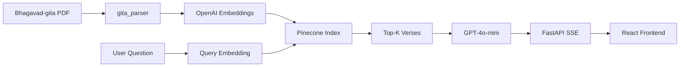

# Bhagavad Gita RAG Chatbot

**Ask Krishna's Wisdom** — answers grounded in *Bhagavad-gita As It Is*, with chapter and verse citations.


---

## About

An AI-powered chatbot that lets you ask philosophical questions about the Bhagavad Gita in natural language and receive thoughtful, grounded answers. Instead of searching through 700 verses manually, you ask a question like *"What is karma? If everything is already written in destiny"* and get a synthesized response backed by the most relevant verses.

The interface walks through three states:

1. **Landing** — A clean chat window with example prompts such as *"What is karma yoga?"* or *"How should one act without attachment?"*
2. **Streaming answer** — A *Krishna's Wisdom* card with a multi-paragraph explanation, chapter/verse references woven into the text, and actionable advice to apply the teaching.
3. **Source attribution** — A *SOURCES* section listing the retrieved verses with chapter and verse numbers, relevance scores, and text previews so every claim is traceable.

---

## Challenges It Resolves

| Challenge | How it's solved |
|-----------|-----------------|
| **LLM hallucination** | Answers are restricted to retrieved verse context; the system prompt requires citing chapter and verse numbers |
| **Hard to search 700 verses** | Semantic vector search over translation and commentary via Pinecone |
| **Trust and transparency** | Source cards show chapter, verse, relevance score, and a text preview for every answer |
| **Complex philosophy made accessible** | Conversational UI with actionable advice — two action points per answer |
| **Real-time UX** | Server-Sent Events (SSE) streaming from FastAPI to React for token-by-token responses |

---

## Technology Stack

| Layer | Technology |
|-------|------------|
| **Language** | Python 3.12+ |
| **LLM** | OpenAI `gpt-4o-mini` |
| **Embeddings** | OpenAI `text-embedding-3-small` (768 dimensions) |
| **Vector DB** | Pinecone (serverless, cosine similarity) |
| **PDF parsing** | `pypdf` + custom regex parser |
| **API** | FastAPI + Uvicorn (SSE streaming) |
| **Frontend** | React 19, TypeScript, Vite 6 |
| **Package management** | `uv` (Python), npm (frontend) |

No LangChain — the RAG pipeline is implemented end to end with the OpenAI SDK and Pinecone client directly.

---

## Architecture



**Ingestion:** A PDF of *Bhagavad-gita As It Is* is parsed into structured verses (translation + commentary), embedded, and stored in Pinecone.

**Retrieval:** The user's question is embedded and matched against verse vectors; the top results become context for the LLM.

**Generation:** GPT-4o-mini synthesizes an answer from that context and streams it to the React frontend, along with source metadata for citation cards.

---

## Project Structure

```
├── ingestion/       # PDF loading, verse parsing, and indexing orchestration
├── embeddings/      # OpenAI text-embedding-3-small wrapper
├── vector_store/    # Pinecone index management and similarity search
├── chat/            # RAG retrieval and LLM generation
├── api/             # FastAPI app and POST /api/chat SSE endpoint
├── scripts/         # CLI tools for indexing chapters and interactive chat
├── frontend/        # React + Vite chat UI
├── config/          # Environment variable loading
└── data/            # Source PDF (local, gitignored)
```

| Module | Role |
|--------|------|
| `ingestion/` | Reads the Gita PDF, extracts verses by chapter, and upserts them into Pinecone |
| `embeddings/` | Converts verse text into 768-dimensional vectors |
| `vector_store/` | Creates the Pinecone index, upserts vectors, and runs similarity queries |
| `chat/` | Retrieves relevant verses and generates grounded answers via GPT-4o-mini |
| `api/` | Exposes a streaming chat endpoint consumed by the frontend |
| `scripts/` | Command-line indexing and chat for development and testing |
| `frontend/` | Chat window, message bubbles, and source citation cards |

---

## Screenshots

### Landing page


### Streaming answer


### Source citations


---

*Source text: Bhagavad-gita As It Is (A.C. Bhaktivedanta Swami Prabhupada)*
